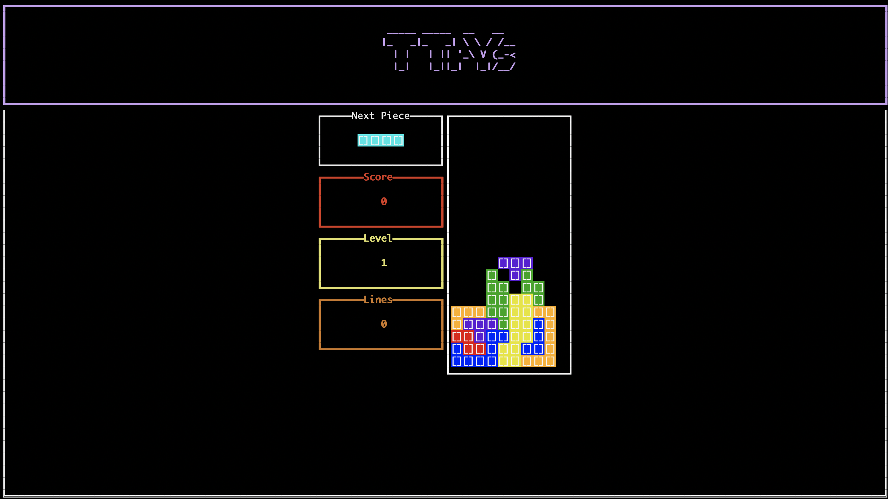

# TTrYs

A terminal-based Tetris game



## Running the game

```shell
cargo run
```

## Playing the game

| Key    | Map
|--------|-------
| a      | move piece left
| s      | "soft drop" down
| d      | move piece right
| Left   | rotate piece counterclockwise
| Right  | rotate piece clockwise
| Space  | pause

## TODO

* Controls legend in UI
* Game Config
* CLI
* Restart after game over

## Running tests

```shell
cargo test
```
